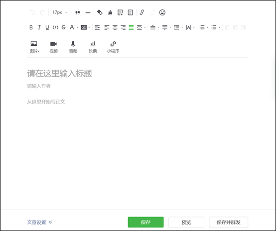
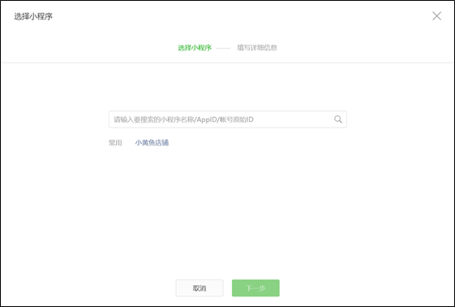
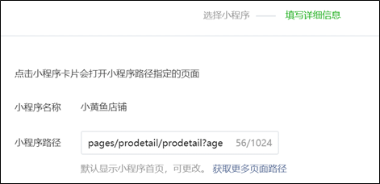
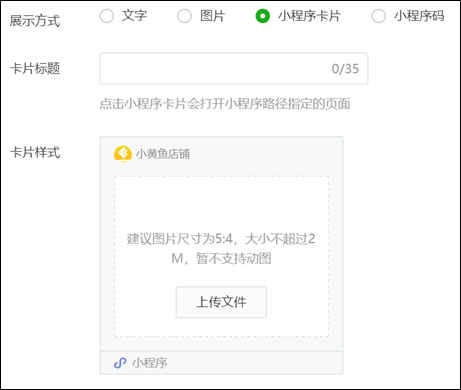
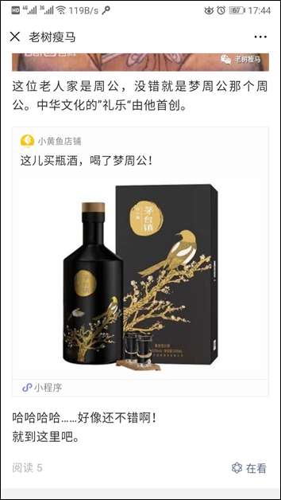

>## 公众号群发消息中添加小黄鱼商品标签

微信公众号（订阅号、服务号）可以群发消息，吸引关注了公众号的微信用户浏览公众号。合作方可以通过在群发的图文消息中嵌入小黄鱼平台商品标签，引导更多的用户关注、购买店铺商品，提高自己店铺的销售量。

**操作步骤：**  

1. 完成关联“小黄鱼店铺”小程序的操作步骤（如上节所述）
2. 在公众号平台中编辑一个图文消息，在消息图文的合适位置选择“`小程序`”按钮，插入一个小程序链接  

3. 在弹出窗口中选择“`小黄鱼店铺`”小程序  

4. 在小程序路径中填入“`pages/prodetail/prodetail?agentId=61000003&proId=1101012`”类似信息。其中“`agentId=`”后面的数字是您的小黄鱼账号ID，“`proId=`”后面的数字表示您打算宣传的商品ID。这两个编号都可以从合作方后台获得  

5. 选择您希望的商品信息在文章中的展示方式。每种方式所需填写的内容不一样，请根据需要填入标题、图片等内容  

6. 保存并群发文章后，在微信公众号中阅览相关消息，就可以看到商品卡片了。用户点击卡片会转到您的小黄鱼店铺中对应商品详情页面  
  
