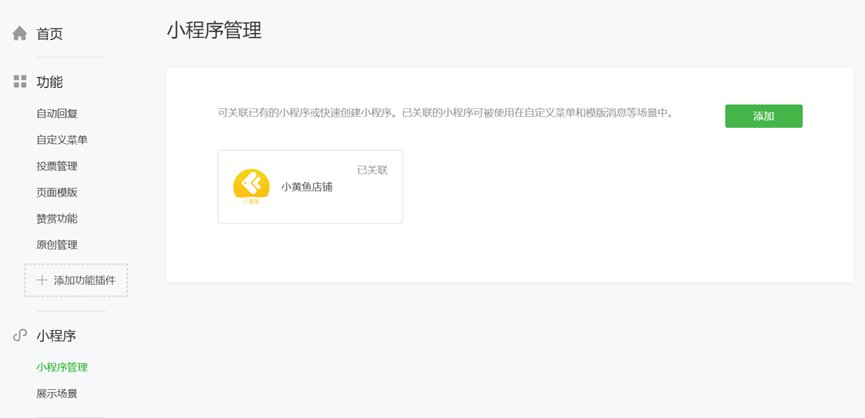
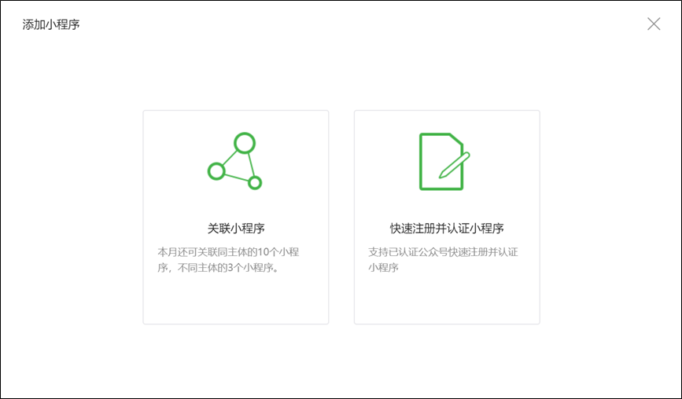
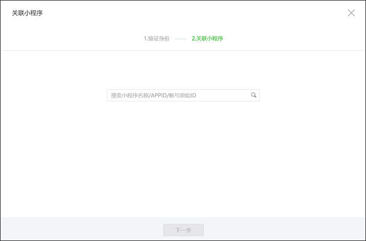
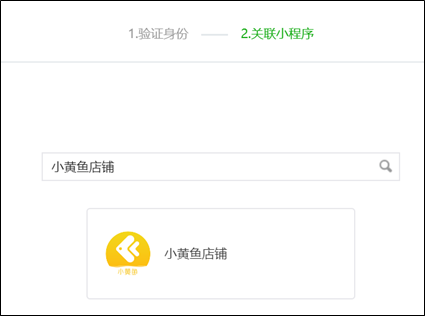
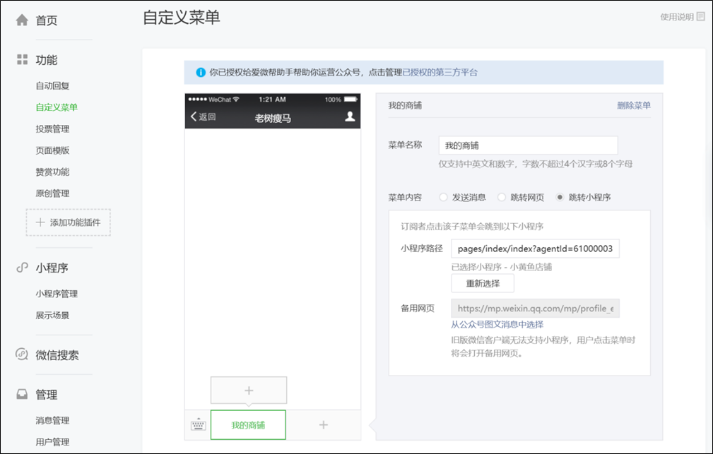
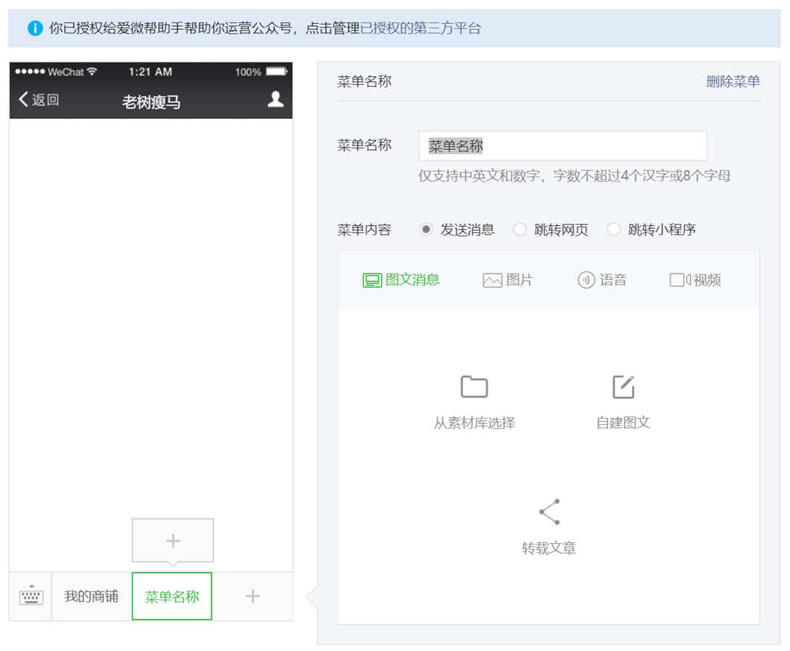
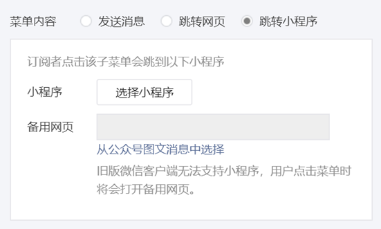
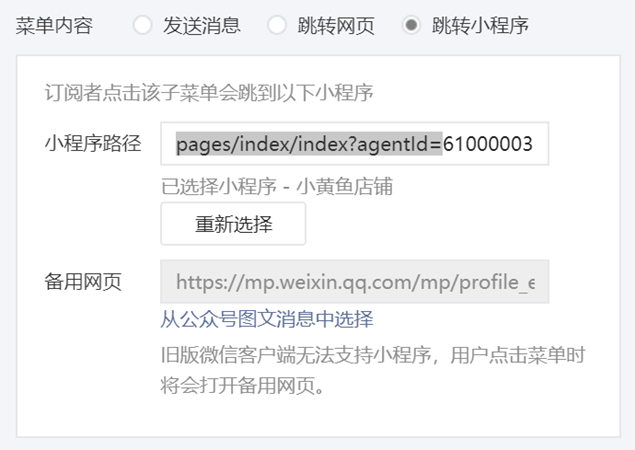

>## 使用微信公众号自定义菜单

在微信公众号中接入小黄鱼商铺最便捷的方式就是以公众号自定义菜单作为入口，使浏览合作方公众号的微信用户通过点击该菜单进入商铺、浏览和购买商品。通过此方式产生的销售返佣直接计入合作方的小黄鱼账号中，从而实现合作方微信公众号流量变现。  

**操作步骤：**

1. 合作方在微信公众平台登陆自己的公众号，点击左侧按钮“`小程序`”-“`小程序管理`”  

2. 点击“`小程序管理`”页面中的“`添加`”按钮，选择弹出窗口中的“`关联小程序`”  

3. 用公众平台对应微信账号的微信扫描二维码验证身份。在“`搜索小程序名称……`”输入框中输入“`小黄鱼店铺`”进行搜索  

4. 选择“`小黄鱼店铺`”进行关联。关联成功后“`小黄鱼店铺`”小程序将显示于小程序管理页面的列表中（如步骤1图）  

5. 选择左侧菜单“`自定义菜单`”，显示如下图所示页面  

6. 点击页面中左边模拟手机屏幕中增加菜单（“`+`”）按钮，推荐添加为“`一级菜单`”  

7. 在右侧“`菜单名称`”中输入您希望的名称；选择“`菜单内容`”为“`跳转小程序`”。点击“`选择小程序`”按钮并选择“`小黄鱼店铺`”(已关联的小程序)  

8. 在小程序路径中输入“`pages/index/index?agentId=12345678`”，其中“`agentId=`”后面的数字填写您的小黄鱼用户ID（在合作方后台中获得）  

9.  点击页面下方的“`预览`”可以预览自定义菜单显示效果，点击“`保存并发布`”即可发布新增加的菜单。关注您公众号的人都可以通过这个新菜单进入您的小黄鱼店铺了！